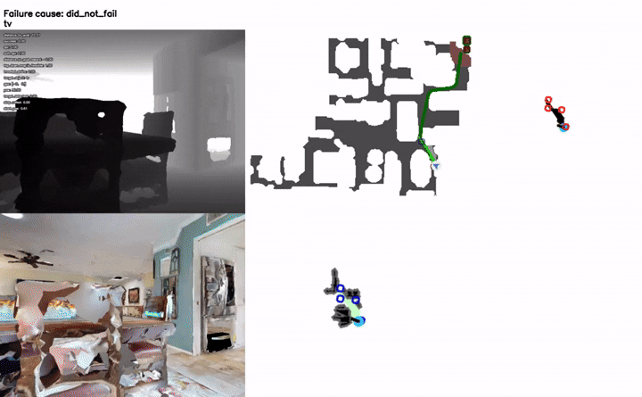

# GLOSM-Nav: Global-Local Open-Vocabulary Semantic Mapping for Zero-Shot Object-Goal Navigation

<p align="center">
  
</p>

## :sparkles: Overview

GLOSM-Nav is a zero-shot semantic navigation framework designed to overcome the challenge of "spatial amnesia" found in reactive modular agents. While standard 2D semantic maps often lack long-term geometric consistency, GLOSM-Nav introduces a persistent **Object-Centric 3D Mapping** system that grounds semantic detections in concrete world coordinates. By integrating high-precision local perception with a hierarchical **Global Scene Fallback** mechanism, the agent bridges the gap between frontier-based exploration and persistent object-centric grounding. This architecture enables robust, zero-shot autonomous search in unfamiliar environments, prioritizing long-horizon geometric memory without the need for large-scale offline training.

## :building_construction: Architecture

GLOSM-Nav pairs a persistent 3D open-vocabulary object memory with frontier-based exploration. Each step runs two stages:

**1. Perception → 3D Semantic Dictionary.** Open-vocabulary detection (YOLOv7 + MobileSAM) segments objects from the RGB-D stream. For every object, hierarchical MetaCLIP features (global scene + context crop + masked crop) are fused, and the masked depth is back-projected into a 3D point cloud. A dual-similarity association check (3D overlap + cosine similarity) either merges the detection into an existing object node or initializes a new one — incrementally building a persistent open-vocabulary semantic dictionary.

<p align="center">
  
  <br><em>Perception and 3D semantic dictionary construction.</em>
</p>

**2. Semantic Mapping → Navigation.** Dictionary objects visible in the current view are scored against the target query and projected into a 2D value map. Frontier candidates are ranked by this value map, filtered by an acyclic enforcer, and the highest-value frontier is handed to a geometric PointNav policy that executes low-level actions — looping until the target is detected and reached.

<p align="center">
  
  <br><em>Navigation: semantic map and value map drive frontier selection and PointNav.</em>
</p>

## :bar_chart: Results

Evaluated on **HM3D ObjectNav-v2** (1,000 episodes, 6 categories) and **MP3D** (cross-dataset generalization, 21 categories). Metrics are Success Rate (SR) and SPL, in %.

#### Zero-Shot Methods
| Method | HM3D SR | HM3D SPL | MP3D SR | MP3D SPL |
|---|---|---|---|---|
| VoroNav | 42.0 | 26.0 | — | — |
| L3MVN | 50.4 | 23.1 | — | — |
| VLFM (baseline) | 52.5 | 30.4 | 36.4 | 17.5 |
| SG-Nav | 54.0 | 24.9 | 40.2 | 16.0 |
| OpenFMNav | 54.9 | 24.4 | — | — |
| TriHelper | 56.5 | 25.3 | — | — |
| **GLOSM-Nav (MetaCLIP)** | **69.9** | **30.52** | *In Progress* | *In Progress* |
| **GLOSM-Nav (OpenCLIP)** | **70.5** | **30.95** | *In Progress* | *In Progress* |
| WMNav | 72.2 | 33.3 | 45.4 | 17.2 |
| CogNav | 72.5 | 26.2 | 46.6 | 16.1 |

#### Trained / Supervised Methods
| Method | HM3D SR | HM3D SPL | MP3D SR | MP3D SPL |
|---|---|---|---|---|
| PIRLNav | 61.9 | 27.9 | — | — |
| Qwen-RobotNav-4B | 75.6 | 30.6 | 52.2 | 16.0 |

**Despite using no navigation training, no world model, and no LLM-based planning, GLOSM-Nav stays competitive with the strongest zero-shot methods (WMNav, CogNav) and approaches trained models like Qwen-RobotNav-4B — which rely on millions of training samples.**

## 1. Initial Setup
```bash
# Clone the Repository & Enter Workspace
cd /path/to/your/workspace
git clone https://github.com/nithishkrishna21/glosm-nav.git
cd glosm-nav

conda create -n glosm_nav python=3.9 -y
conda activate glosm_nav 

# 1. Install CUDA Toolkit
conda install cudatoolkit=11.8 -c conda-forge

# 2. Install PyTorch stack for CUDA 11.8
pip install torch==2.2.0 torchvision==0.17.0 --index-url https://download.pytorch.org/whl/cu118

# 3. Install cuDNN
conda install cudnn=8.3.2 -c conda-forge

# 4. Install Habitat-Sim
conda install habitat-sim=0.2.4 withbullet headless -c conda-forge -c aihabitat

# 5. Install Habitat-Lab & Core Dependencies
pip install -e .[habitat]

# 6. Install Modern VLM Dependencies (Transformers & Accelerate)
pip install --upgrade "transformers>=4.47.0"
pip install accelerate

# 7. Install Pinned Image/Data Dependencies
pip install numpy==1.26.4 scipy==1.12.0 Pillow==9.5.0 imageio-ffmpeg==0.6.0 numba==0.59.1
pip install opencv-python==4.5.5.64
pip install spacy==3.5.0 thinc==8.1.12

# 8. Install GroundingDINO (Pinned Commit)
pip install git+https://github.com/IDEA-Research/GroundingDINO.git@eeba084341aaa454ce13cb32fa7fd9282fc73a67

# 9. Clone Detector Sub-Repositories (for Config Files & Weights)
# These should be cloned into the root of the 'glosm-nav' directory
git clone https://github.com/IDEA-Research/GroundingDINO.git
git clone https://github.com/WongKinYiu/yolov7.git

# 10. Prepare Model Weights & Downloads
mkdir -p /workspace/glosm-nav/data
cd /workspace/glosm-nav/data

# Download MobileSAM Weights
wget https://github.com/ChaoningZhang/MobileSAM/raw/master/weights/mobile_sam.pt

# Download GroundingDINO Weights
wget https://github.com/IDEA-Research/GroundingDINO/releases/download/v0.1.0-alpha/groundingdino_swint_ogc.pth
```

### 11. Hotpatch YOLOv7 Git Tag Issue
This prevents errors during model initialization by explicitly pointing to the local tag.
```bash
cd /workspace/glosm-nav/yolov7
git tag v0.1
```

**Manual Fix**: In `yolov7/utils/google_utils.py`, change **Line 31**:
*   **FROM**: `tag = subprocess.check_output('git tag', shell=True).decode().split()[-1]`
*   **TO**: `tag = subprocess.check_output('cd /workspace/glosm-nav/yolov7 && git tag', shell=True).decode().split()[-1]`

### 12. Optional: Disable Auto-Tmux (For Cluster Environments)
If your server automatically forces you into a `tmux` session on login, run this to disable that behavior:
```bash
touch ~/.no_auto_tmux
```

---

## 2. Dataset Setup
You must download the Habitat-Matterport 3D (HM3D) dataset (v0.1 and v0.2). You will need an active Matterport account to obtain the access credentials.

### Environment Setup
Replace the placeholders with your actual Matterport tokens:
```bash
export MATTERPORT_USERNAME="<YOUR_MATTERPORT_USERNAME_HERE>"
export MATTERPORT_PASSWORD="<YOUR_MATTERPORT_PASSWORD_HERE>"
export DATA_PATH="</absolute/path/to/your/glosm-nav/data>"
```

### Symlinking Shared Data (Optional)
If your HM3D dataset meshes are stored on a centralized shared lab drive to save space, you must symlink them into the `glosm-nav/data` folder so Habitat can dynamically find them:
```bash
ln -s /path/to/shared/hm3d/versioned_data $DATA_PATH/versioned_data
```

### Download commands
Run the following scripts via the Habitat dataset downloader:

**Download HM3D v0.1 (For Ablations):**
```bash
python -m habitat_sim.utils.datasets_download \
  --username $MATTERPORT_USERNAME \
  --password $MATTERPORT_PASSWORD \
  --uids hm3d_val_v0.1 \
  --data-path $DATA_PATH
```

**Download HM3D v0.2 (For SOTA Benchmark):**
```bash
python -m habitat_sim.utils.datasets_download \
  --username $MATTERPORT_USERNAME \
  --password $MATTERPORT_PASSWORD \
  --uids hm3d_val_v0.2 \
  --data-path $DATA_PATH
```

**Download MP3D (For Zero-Shot Generalization):**
*Note: Due to Matterport licensing, this uses a modernized open-source Python 3 downloader rather than the legacy Python 2.7 script.*
```bash
cd $DATA_PATH

wget https://raw.githubusercontent.com/wtzmx/Matterport3D-Dataset-Downloader/main/download_mp.py
wget https://raw.githubusercontent.com/wtzmx/Matterport3D-Dataset-Downloader/main/matterport3d_scan_ids.txt

# Download ONLY the Habitat meshes (and tiny intrinsics files to bypass the massive raw image dumps)
python download_mp.py -o ./scene_datasets/mp3d \
  --scans matterport3d_scan_ids.txt \
  --task_data habitat \
  --type matterport_camera_intrinsics

# Scoop the actual scene folders up to the root mp3d directory structure
mv ./scene_datasets/mp3d/v1/mp3d/* ./scene_datasets/mp3d/

# Delete the leftover 'v1' directory containing the scans/intrinsics junk
rm -rf ./scene_datasets/mp3d/v1
rm download_mp.py matterport3d_scan_ids.txt
```

### Download ObjectNav Task Episodes
After downloading the 3D scene meshes, you must pull down the JSON files that define the actual ObjectNav goals and start positions.

**ObjectNav v1 Episodes (For Ablations):**
```bash
cd $DATA_PATH
wget https://dl.fbaipublicfiles.com/habitat/data/datasets/objectnav/hm3d/v1/objectnav_hm3d_v1.zip
unzip objectnav_hm3d_v1.zip
mkdir -p datasets/objectnav/hm3d
mv objectnav_hm3d_v1 datasets/objectnav/hm3d/v1
rm objectnav_hm3d_v1.zip
```

**ObjectNav v2 Episodes (For SOTA Benchmark):**
```bash
cd $DATA_PATH
wget https://dl.fbaipublicfiles.com/habitat/data/datasets/objectnav/hm3d/v2/objectnav_hm3d_v2.zip
unzip objectnav_hm3d_v2.zip
mkdir -p datasets/objectnav/hm3d
mv objectnav_hm3d_v2 datasets/objectnav/hm3d/v2
rm objectnav_hm3d_v2.zip
```

**ObjectNav MP3D v1 Episodes (For MP3D Zero-Shot Generalization):**
```bash
cd $DATA_PATH
wget https://dl.fbaipublicfiles.com/habitat/data/datasets/objectnav/m3d/v1/objectnav_mp3d_v1.zip
unzip objectnav_mp3d_v1.zip
mkdir -p datasets/objectnav/mp3d/v1
mv train val val_mini datasets/objectnav/mp3d/v1/
rm objectnav_mp3d_v1.zip
```

---

## 3. Launch the VLM Model Servers (Required Before Any Run)
GLOSM-Nav queries the perception models (GroundingDINO, MobileSAM, YOLOv7, CLIP) as persistent HTTP servers. **You must start these servers before running any evaluation below.** Each script spins up all four servers in a `tmux` session, on a dedicated GPU and matching ports for that config:

```bash
./scripts/config_scripts/launch_config1.sh   # OpenCLIP + IoU      (GPU 0)
./scripts/config_scripts/launch_config2.sh   # OpenCLIP + Overlap  (GPU 1)
./scripts/config_scripts/launch_config3.sh   # MetaCLIP + IoU      (GPU 2)
./scripts/config_scripts/launch_config4.sh   # MetaCLIP + Overlap  (GPU 3)
```

> **Note:** Wait up to ~90 seconds for the model weights to finish loading before launching the evaluation. The ports set by each `launch_configN.sh` match the ports used in the corresponding evaluation config below.

---

## 4. Parallel Ablation Studies (4 GPU Setup)
To test the different variations of GLOSM-Nav simultaneously, you can launch four `tmux` sessions to run parallel jobs on distinct GPUs with isolated network ports.

> **Note:** Ensure your conda environment (e.g. `glosm_nav`) is activated in each session window.

### Config 1: OpenCLIP + IoU
```bash
tmux new -s hm3d_objectnav_v1_config1
conda activate glosm_nav
export CUDA_VISIBLE_DEVICES=0
export SAM_PORT=12183
export YOLOV7_PORT=12184
export GROUNDING_DINO_PORT=12181
export CLIP_PORT=12186

python -um vlfm.run --config-name=experiments/object_centric_hm3d habitat_baselines.rl.policy.geometric_sim_type="iou" habitat_baselines.tensorboard_dir="tb/hm3d_objectnav_v1_config1" 2>&1 | tee logs/hm3d_objectnav_v1_config1.log
```

### Config 2: OpenCLIP + Overlap (NN-Ratio)
```bash
tmux new -s hm3d_objectnav_v1_config2
conda activate glosm_nav
export CUDA_VISIBLE_DEVICES=1
export SAM_PORT=13183
export YOLOV7_PORT=13184
export GROUNDING_DINO_PORT=13181
export CLIP_PORT=13186

python -um vlfm.run --config-name=experiments/object_centric_hm3d habitat_baselines.rl.policy.geometric_sim_type="overlap" habitat_baselines.tensorboard_dir="tb/hm3d_objectnav_v1_config2" 2>&1 | tee logs/hm3d_objectnav_v1_config2.log
```

### Config 3: MetaCLIP + IoU
```bash
tmux new -s hm3d_objectnav_v1_config3
conda activate glosm_nav
export CUDA_VISIBLE_DEVICES=2
export SAM_PORT=14183
export YOLOV7_PORT=14184
export GROUNDING_DINO_PORT=14181
export CLIP_PORT=14186

python -um vlfm.run --config-name=experiments/object_centric_hm3d habitat_baselines.rl.policy.geometric_sim_type="iou" habitat_baselines.tensorboard_dir="tb/hm3d_objectnav_v1_config3" 2>&1 | tee logs/hm3d_objectnav_v1_config3.log
```

### Config 4: MetaCLIP + Overlap (NN-Ratio)
```bash
tmux new -s hm3d_objectnav_v1_config4
conda activate glosm_nav
export CUDA_VISIBLE_DEVICES=3
export SAM_PORT=15183
export YOLOV7_PORT=15184
export GROUNDING_DINO_PORT=15181
export CLIP_PORT=15186

python -um vlfm.run --config-name=experiments/object_centric_hm3d habitat_baselines.rl.policy.geometric_sim_type="overlap" habitat_baselines.tensorboard_dir="tb/hm3d_objectnav_v1_config4" 2>&1 | tee logs/hm3d_objectnav_v1_config4.log
```

---

## 5. Automated Complete Evaluation (Grand Tour)
For the final baseline or benchmark evaluation over the full dataset (e.g. `v0.2`), launch the multi-process infrastructure to host the vision-language backbone models, then sequentially run the evaluation policy.

### Run 1: OpenCLIP (Config 1 Best)
```bash
tmux new -s hm3d_objectnav_v2_config1
conda activate glosm_nav
export CUDA_VISIBLE_DEVICES=0
export SAM_PORT=12183
export YOLOV7_PORT=12184
export GROUNDING_DINO_PORT=12181
export CLIP_PORT=12186

python -um vlfm.run --config-name=experiments/glosm_hm3d_objectnav_v2 \
  habitat_baselines.rl.policy.geometric_sim_type="iou" \
  habitat_baselines.tensorboard_dir="tb/hm3d_objectnav_v2_config1" \
  2>&1 | tee logs/hm3d_objectnav_v2_config1.log
```

### Run 2: MetaCLIP (Config 3 Best)
```bash
tmux new -s hm3d_objectnav_v2_config3
conda activate glosm_nav
export CUDA_VISIBLE_DEVICES=1
export SAM_PORT=14183
export YOLOV7_PORT=14184
export GROUNDING_DINO_PORT=14181
export CLIP_PORT=14186

python -um vlfm.run --config-name=experiments/glosm_hm3d_objectnav_v2 \
  habitat_baselines.rl.policy.geometric_sim_type="iou" \
  habitat_baselines.tensorboard_dir="tb/hm3d_objectnav_v2_config3" \
  2>&1 | tee logs/hm3d_objectnav_v2_config3.log
```

---

## 6. MP3D Zero-Shot Evaluation
To evaluate your pipeline's generalization capabilities on the Matterport3D dataset, use the dedicated MP3D config. We will launch the two best variants in parallel against this new dataset.

### Run 1: OpenCLIP (Config 1 Best)
```bash
tmux new -s mp3d_objectnav_config1
conda activate glosm_nav
export CUDA_VISIBLE_DEVICES=0
export SAM_PORT=12183
export YOLOV7_PORT=12184
export GROUNDING_DINO_PORT=12181
export CLIP_PORT=12186

python -um vlfm.run --config-name=experiments/glosm_mp3d_objectnav \
  habitat_baselines.rl.policy.geometric_sim_type="iou" \
  habitat_baselines.tensorboard_dir="tb/mp3d_objectnav_config1" \
  2>&1 | tee logs/mp3d_objectnav_config1.log
```

### Run 2: MetaCLIP (Config 3 Best)
```bash
tmux new -s mp3d_objectnav_config3
conda activate glosm_nav
export CUDA_VISIBLE_DEVICES=1
export SAM_PORT=14183
export YOLOV7_PORT=14184
export GROUNDING_DINO_PORT=14181
export CLIP_PORT=14186

python -um vlfm.run --config-name=experiments/glosm_mp3d_objectnav \
  habitat_baselines.rl.policy.geometric_sim_type="iou" \
  habitat_baselines.tensorboard_dir="tb/mp3d_objectnav_config3" \
  2>&1 | tee logs/mp3d_objectnav_config3.log
```

---

## 7. Monitoring Progress
To check back in on your logging later, view your active sessions and reattach to the correct one:
```bash
tmux ls

# If monitoring HM3D OpenCLIP (Config 1):
tmux attach-session -t hm3d_objectnav_v2_config1

# If monitoring HM3D MetaCLIP (Config 3):
tmux attach-session -t hm3d_objectnav_v2_config3

# If monitoring MP3D OpenCLIP (Config 1):
tmux attach-session -t mp3d_objectnav_config1

# If monitoring MP3D MetaCLIP (Config 3):
tmux attach-session -t mp3d_objectnav_config3
```

---

## Acknowledgements

This repository is built heavily on top of [**VLFM** (Vision-Language Frontier Maps)](https://github.com/bdaiinstitute/vlfm) by the Boston Dynamics AI Institute — its frontier-based value-map navigation infrastructure forms the backbone of GLOSM-Nav. We are grateful to the authors for open-sourcing their work.

The 3D semantic mapping additionally adapts ideas from [**ConceptGraphs**](https://github.com/concept-graphs/concept-graphs) (open-vocabulary 3D object association) and [**HOV-SG**](https://github.com/hovsg/HOV-SG) (hierarchical CLIP feature fusion).
